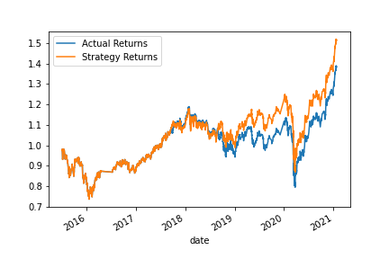
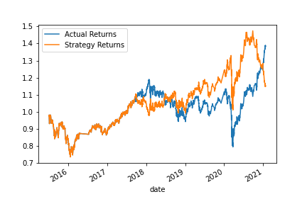

# Trading Algorithm Anaylsis

Evaluation Report:

When grabbing the data from the CSV file and slicing the data, trading signals were generated using short and long term SMA values. Once this was found, the signals on when to the buy/sell were calculated by defining to buy when the "Actual Return" of the stock price of that particular time was above zero. Else, sell when below zero. Then, the strategy returns were found to plot the performance of this algorithm.

The data was then split into training and testing datasets, with scaling the X training and testing datasets. Once scaled, the first classifier model was used to make predictions based on the testing data. The first classifer model used was the SVC Model. When running the classification report, the results shown were the following: accuracy was 55%, precision was 43% and recall was 4% to sell, and precision was 56% and recall was 96% to buy. 

A new DataFrame was created that contained the predicted values for this model, the actual returns and the strategy returns. The performance plot showing the actual returns versus the strategy returns was as follows:

The plot shows that the returns predicted from this model performed better than the actual returns of the algorithm. 

The second classifer model used was the Logistic Regression Model. When running the classification report, the results shown were the following: accuracy was 52%, precision was 44% and recall was 33% to sell, and precision was 56% and recall was 66% to buy. 

A new DataFrame was created that contained the predicted values for this model, the actual returns and the strategy returns. The performance plot showing the actual returns versus the strategy returns was as follows:

The plot shows that for the most part, the strategy returns outperformed the actual returns except for 2021. On this year, you can see the returns inversed and shows the actual returns performing higher.

Comparing the classification report for the SVM Model and the LR Model, that report shows that the SVM model had a better accuracy than the LR model. The precision to buy and sell for both models were similar, however the recall was greater in the LR model vs the SVM model. Seems that there needs to be further analysis to determine which model had the better perfomance. 
